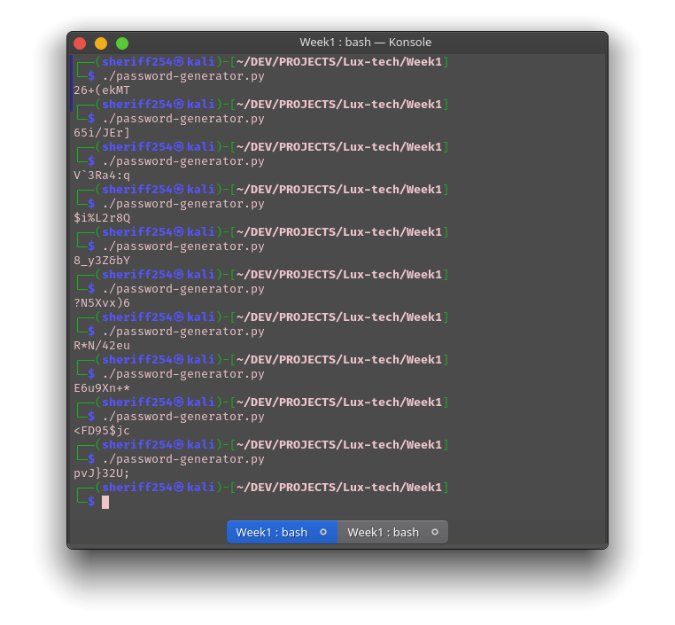
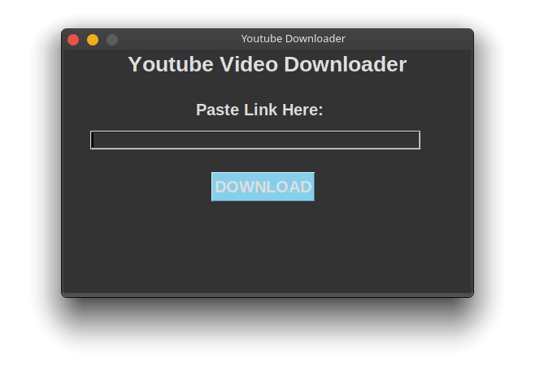
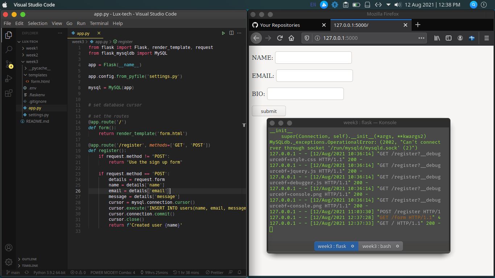

# Python Boot Camp by LuxTech

## Week 1 (Technical skills): Random password generator

**The project is to test on python technical skills.**

Task:
Use a python script to generate a random password of 8 characters long and will have to include any of the following characters in any order:

- [x] 2 upperCase letters A-Z
- [x] 2 lowerCase letter a-z
- [x] 2 digits 0-9
- [x] 2 symbols

## Testing the script

## Week 2: Youtube Downloader

## Week 3: Flask application

